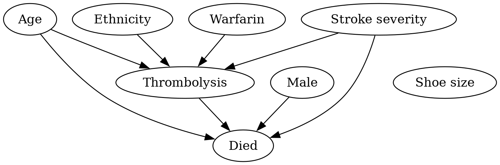
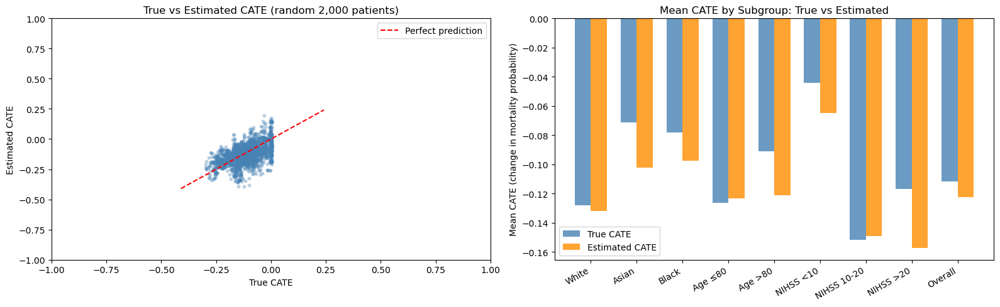

# SAMueL-3 data science journal June 2026

## 9 June 2026

**Causal discovery pipeline**

This ran through a pilot causal AI pipeline, identifyign causal relationships, and measuring treatment effect size, using simulated data with complex interactions.

The DAG produced was correct, but this was 100,000 simulated data. How will sample size affect results?

Causal forests were used to measure treatment effects in subgroups. There was a tendency for the model to regularise results so that all subgroups were closer to the population average treatment than they should be. How does this compare with fitting an XGBoost model and using SHAP? Is there a way to adjust regularisation? Should we include propensity and outcome nuisance models?

### Further experiments

* Reduce data size, and run repeated causal discovery with different random seeds for data generation
* Compare treatment effect estimation with XGBoost/SHAP
* Build in propensity and outcome nuisance models into Causal Forests

